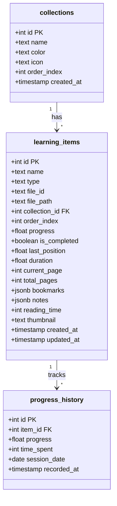
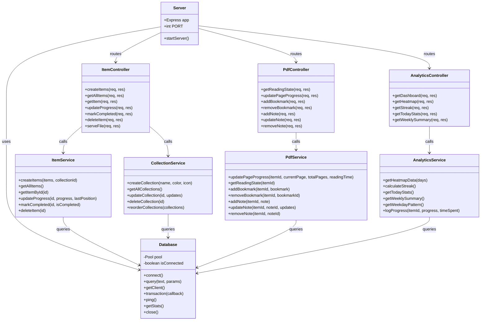
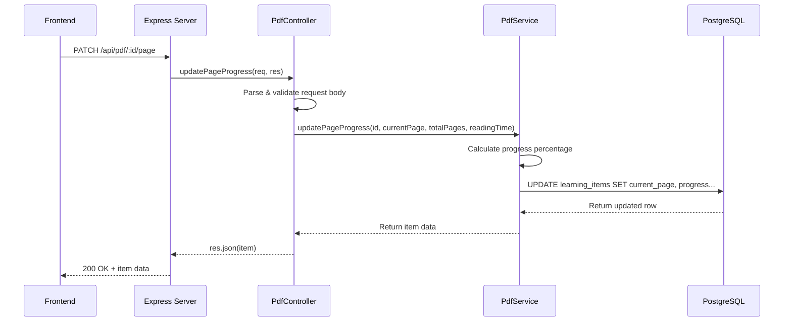
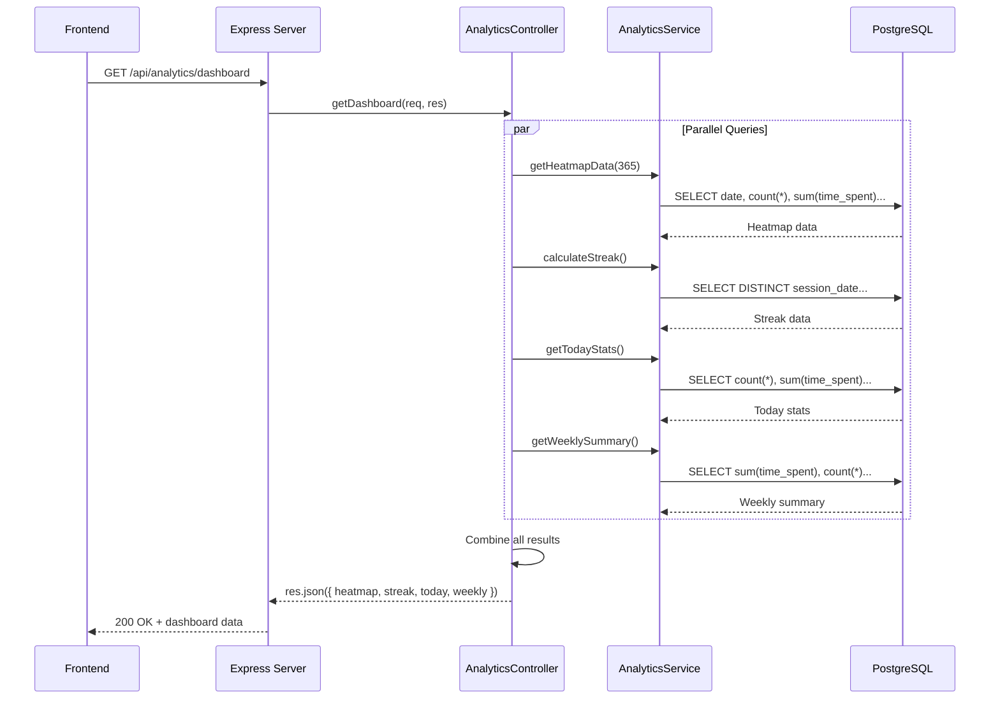
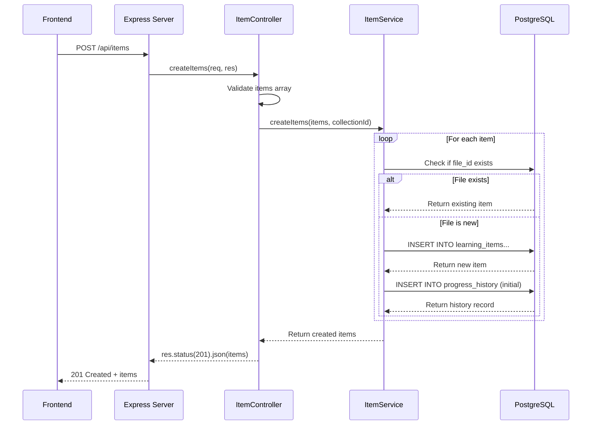
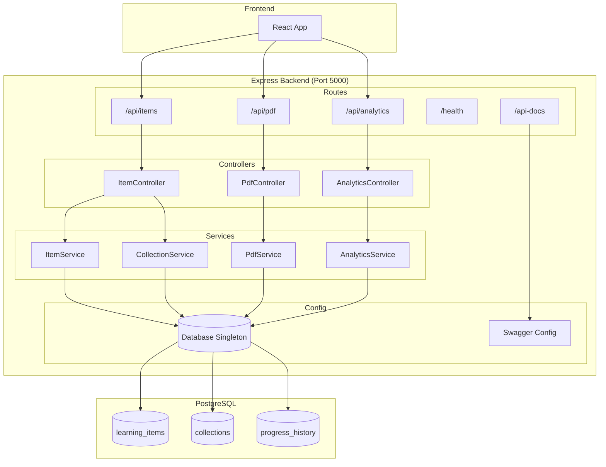
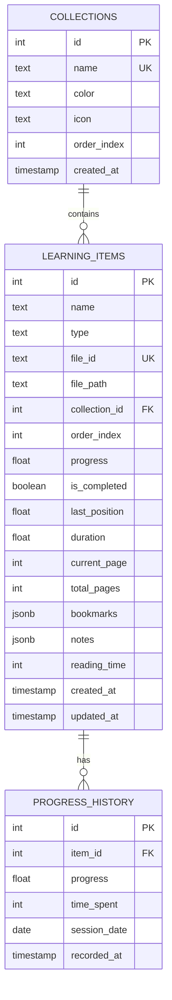
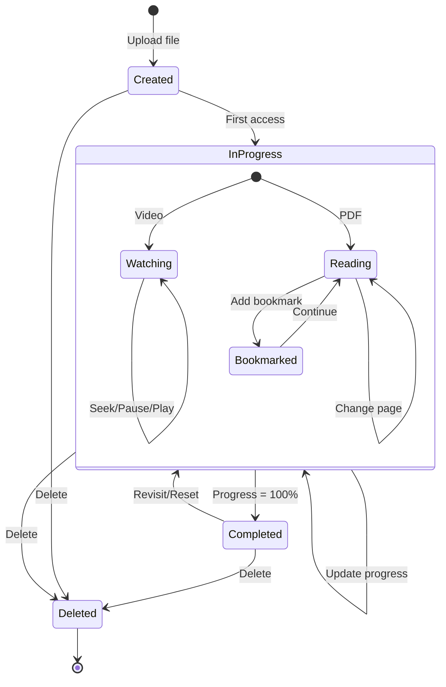

# Backend UML Diagrams

This document contains UML diagrams for the Learning Progress Tracker backend architecture.

---

## 1. Class Diagram - Database Schema

---

## 2. Class Diagram - Backend Architecture

---

## 3. Sequence Diagram - PDF Page Progress Update

---

## 4. Sequence Diagram - Analytics Dashboard

---

## 5. Sequence Diagram - Item Creation with Progress History

---

## 6. Component Diagram - API Structure

---

## 7. Entity Relationship Diagram

---

## 8. State Diagram - Learning Item Lifecycle

---

## Notes

- All diagrams use Mermaid syntax for rendering
- View in VS Code with Mermaid preview extension or on GitHub
- The Database class implements the Singleton pattern
- Controllers handle HTTP request/response
- Services contain business logic
- All database operations go through the connection pool
